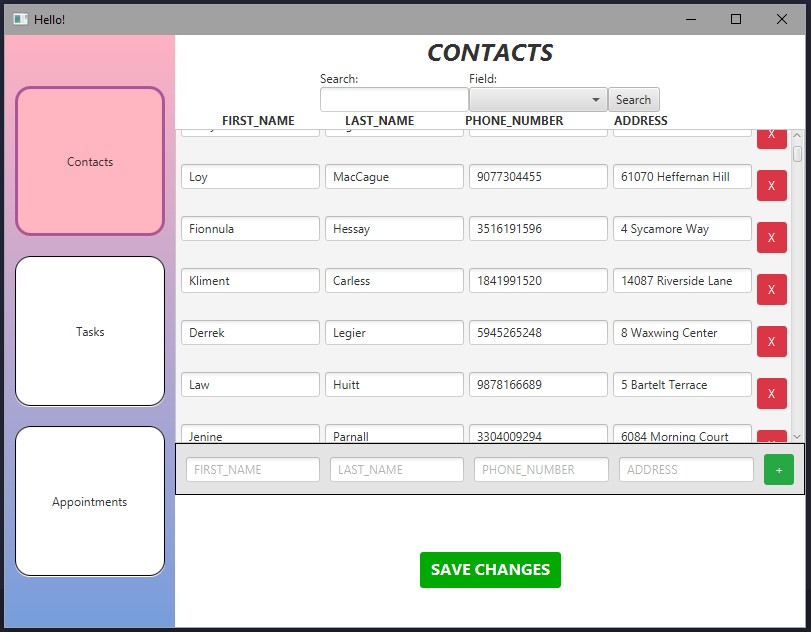
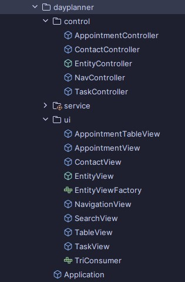
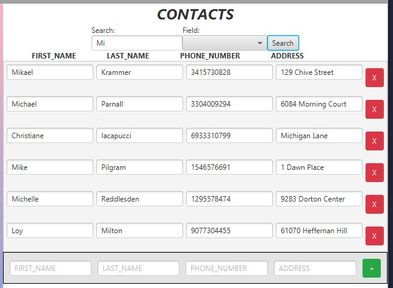
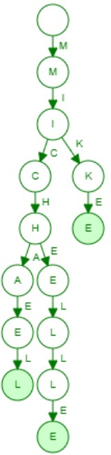
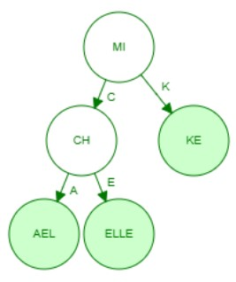

# Day Planner

## Original Artifact Description

For **CS320 – Software Testing, Automation, and QA**, I learned software testing practices for early and frequent defect mitigation during development of the course project. The core project was a basic management system (Contacts, Tasks, and Appointments) with the following characteristics:

- **CRUD operations** for each object type, with each object having a unique ID 
- **Validation Requirements** to ensure data integrity (minimum/maximum number of characters, non-null, no whitespace)  
- **Extensive JUnit Testing**: 120 JUnit tests were coded to minimize defects, following test-driven development practices and using strategies such as equivalence partitioning, boundary value analysis, and statement/decision testing

## Enhancements
Below are two enhancements I made to the original artifact. Each section can be expanded to read a **detailed narrative** of what was changed and why.

---

   
<h3 style="display:inline">Enhancement One Narrative – JavaFX GUI</h3>

    
   

   <h4>Artifact Description</h4>

   
The artifact I’ve enhanced is <i>Day Planner</i>, a JavaFX GUI application created from modifications to an original project made as part of my coursework for CS320: Software Testing, Automation, and QA. The original project was a basic service management system for different object types–<code>Contact</code>, <code>Task</code>, and <code>Appointment</code> with Create, Read, Update, and Delete operations with input validation based on object attribute constraints. It also included extensive JUnit testing with 120 tests to ensure the reliability of its functionality. 
   My enhancement transforms the original project into a fully functional user-facing application by adding a GUI built with JavaFX that allows users to interact with the system. This GUI includes separated screens for managing Contacts, Tasks, and Appointments, featuring editable data tables and persistent data storage through CSV files, improving the system’s usability and testing capabilities.

   <h4>Justification of Enhancements</h4>

   
I’ve included this artifact in my ePortfolio because it is a prime example of my skills related to Software Engineering/Design, a critical area I want to showcase. I’ve enhanced this artifact because the original was strong in functionality and testing, but it lacked usability and user testing capabilities. Enhancing it with a user interface allowed me to demonstrate key software development skills through the additional components, aligning it with professional software engineering standards.

   
The JavaFX GUI components provide users with screens for managing Contacts, Tasks, and Appointments, showcasing my ability to implement effective user interfaces and understanding of reusable and modular UI design with components like <code>TableView</code>, which dynamically generates data rows for any data object with functional controls. Object storage persistence is achieved by including components like <code>ServiceFileUtil</code> and the <code>CsvSerializable</code> interface, showcasing my ability to handle file input or output by writing <code>Appointment</code>, <code>Contact</code>, and <code>Task</code> objects into CSV files and reading them back into the program. GUI elements are organized into <i>controller</i> and <i>UI</i> packages, separating UI logic from business logic using controllers like <code>ContactController</code> and views like <code>ContactView</code>, demonstrating my ability to design and integrate a separation of backend and frontend components. Reusability utilities like <code>InputValidator</code> were created to demonstrate input validation and error handling skills within the system, preventing invalid data from being stored and processed by the application.

   
By including these enhancements, I’ve significantly improved the usability of the system while achieving maintainability and modularization, making it a valuable addition to my ePortfolio.

   <h4>Course Outcomes Achieved</h4>

   
I’ve developed the enhancement with the intention to meet the course outcomes outlined in this capstone course. 
   Building Collaborative Environments - The project’s code includes detailed documentation through JavaDoc comments, and the code is hosted on GitHub to enable contributors to make decisions and contributions regarding the project. Thorough modularity and readable code further encourage future collaboration.

   <ul>
     <li><b>Professional Communication</b> - Documentation provides clear communication for technical users, however, to best meet this outcome, I intend to add audience-friendly communication in the GUI, including descriptive error messages for invalid input or additional navigation messages. I will also add a README for all audiences explaining usage and enhancement details.</li>
     <li><b>Designing and Evaluating Computing Solutions</b> - The project balances trade-offs between performance and persistence by using memory-based storage for speed during runtime and file-based storage for data persistence, demonstrating an understanding of computing solution standards and involved trade-offs.</li>
     <li><b>Utilizing Innovative Techniques and Tools</b> - Industry standard tools like JavaFX for UI development and Java library classes like <code>BufferedReader</code> and <code>BufferedWriter</code> for file handling are utilized to implement the enhancement and efficiently add value to this project.</li>
   </ul>

   <h4>Enhancement Process Reflection</h4>

   

      Enhancing this project was a very challenging process that I began by planning my enhancements to improve user interaction and system scalability. First, in designing the architecture for the JavaFX application, I structured it into module components with individual view and controller classes for each major screen and screen component. Learning to effectively separate UI logic from backend service was initially challenging. However, through research and development, I learned to delegate UI responsibilities to View classes and business logic to Controller classes, separating frontend and backend to create a maintainable architecture.
       
   

   
I encountered challenges in implementing reusable components like the <code>TableView</code> class, which dynamically creates a data table with editable fields specific to each object type. Reusable components required an understanding of Java generics and interfaces. Implementing '<code>F extends Enum&lt;F&gt;</code>' in the <code>Entity</code> class enabled dynamic field handling, which was key to my learning of flexible code structure and streamlining integration of other object types. File-based persistence introduced additional challenges, as I had to develop an understanding of file I/O. I designed a custom CSV file I/O system for parsing files, rather than relying on external libraries, to deepen my understanding of these operations and build confidence, though it added time constraints to the project.

   
Throughout development, time management was a recurring challenge. Each challenge provided significant time constraints that I could not fully accommodate, so despite completing core functionalities, I could not implement the advanced features I planned, like CSS styling and unit tests for GUI components. I also have additions to make to the functionality of the appointment management screen and user-facing error messages. Seeking guidance from online communities revealed strongly held conflicting opinions, emphasizing the need to critically evaluate advice in a timely manner. Going forward, especially when faced with time constraints, I will be sure to focus on time-efficient coding by using additional libraries for common utilities like CSV file parsing, input validation and sanitization, ID generation, etc. when appropriate.
 

---

   
 <h3>Enhancement Two Narrative – Radix Trie Search</h3> 

    
   

   <h4>Artifact Description</h4>

   
For the second enhancement, I’ve extended the object lookup capabilities of the service classes to enable efficient searches by any attribute such as <code>firstName</code>, <code>lastName</code>, <code>phone</code>, or <code>address</code> for <code>Contact</code>, using a prefix search algorithm that can return all results that start with the specified prefix. To achieve this, the service class uses a custom Radix tree (also compact trie) data structure, which efficiently indexes object attributes for optimized searching with prefix-based retrieval.

   <h4>Justification of Enhancements</h4>

   
This artifact is ideal for inclusion in my ePortfolio because it demonstrates my ability to implement advanced data structures to enhance an existing artifact and benefit from optimized algorithms. The original artifact had limited search functionality, relying only on HashMaps for ID-based lookups. To improve this, I implemented a search functionality in the application that allows a user to search for objects using a full or partial match and specifying the field to search by (such as first name, last name, etc.), which required implementing a custom data structure. By developing the Radix Tree data structure, I’ve showcased my ability to implement a data structure that prioritizes fast retrieval while balancing space complexity. Choosing the data structure and implementing the CompactTrie class, which I will describe in the Enhancement Process Reflection section, requires skills in understanding the time and space complexity of different operations and evaluating them to choose the ideal structure and search algorithm for my application. I’ve demonstrated these skills by successfully implementing a radix tree data structure and prefix search algorithm, which allowed me to add search functionality to the JavaFX GUI by integrating these modules–another skill demonstrating the ability to implement user-facing features.
 

   
Overall, by using every attribute of each object as a search key to provide fast search functionality with partial string lookups, this enhancement directly improves the usability and efficiency of the application.
 

   <h4>Course Outcomes Achieved</h4>
   
 I’ve developed the enhancement to meet the course outcomes outlined in this capstone course.
 
   <ul>
      <li><b>Building Collaborative Environments</b> - The project, hosted on Github to allow future contributors to review and improve the code, also features comprehensive Javadoc documentation and inline comments for all classes and methods, ensuring future readability and clarity for others and myself.  This enhancement builds upon previous documentation by including documentation in the CompactTrie and SearchView classes.</li>
      <li><b>Professional Communication</b> - Updated documentation throughout the additions explains the process to achieve a specific goal and the improvements made. Improvements made to the GUI’s style and labeling communicate to the user not only the new search functionality, but also any important error messages regarding invalid input that need to be addressed with red outlining or text for invalid fields. </li>
      <li><b>Designing and Evaluating Computing Solutions</b> - The original HashMap retrieval is limited to average constant <i>O(1)</i> lookups. It cannot be used to look up an object's other attributes without creating a new HashMap for each attribute with entries for each attribute. Throughout development, I’ve analyzed trade-offs of other data structures until selecting the Radix Tree data structure, with a search complexity of <i>O(k)</i>, where <i>k</i> is the search key's length. </li>
      <li><b>Utilizing Innovative Techniques and Tools</b> - Trie data structures and compact tries (Radix tree) are innovative data structure techniques that are commonly implemented in computing due to prefix-based searches for applications like text autocompletion, file path navigation, IP routing, and so on. I’ve utilized these data structures in my application for the same benefits of efficient prefix lookup.</li>
   </ul>

   <h4>Enhancement Process Reflection</h4>

   <b>Problems with BSTs</b>

   
I initially planned to use a Binary Search Tree (BST) for searching objects by attributes, where each node in the tree stored the field and attribute value as a key (“Michael” for FIRST_NAME), a reference to the object, a left child node (with a key that is &lt;= the parent key) and a right child node (with a key that is &gt; the parent key). Naively, I thought BSTs could handle prefix searches by locating the first matching node (“Michael” when searching “Mich”) and traversing both subtrees to collect only continuous nodes that start with the prefix. After fully implementing the BST, I discovered the flaw in this is that a non-matching middle node could separate two matches, disrupting the continuous range. This match is missed unless I traverse the entire BST, which degrades the search time complexity to <i>O(N)</i>, leading me to explore alternative structures.

   
 
       
      <b>Radix Trees to the Rescue</b> 
        Through research, I discovered that Trie structures were better suited for my use case and were designed to handle prefixes, breaking each word into character nodes where the hierarchical path forms a word. The figure on the left, generated with the <a href="https://www.cs.usfca.edu/~galles/visualization/Trie.html" target="_blank">USFCA Trie Visualizer</a>, shows this structure. Searching “Mi,” we locate the “I” node and descendant paths are valid matches (“MIKE,” “MICHAEL,” and “MICHELLE”). However, with potentially thousands of stored attributes and considering some fields like address contain up to 50 characters, there would be an excessive space complexity.
   

   
A Compact Trie (Radix Tree) improves on this by merging common prefixes into single nodes, significantly decreasing the space overhead, though implementation is more complex.

   

   

      
      <b>Challenges in Implementing a Radix Tree</b>
       Handling object storage and field associations was a challenge because multiple objects can have the same attribute value, one object can have duplicate attributes across fields, and searches can be field-specific. To address this, I ensured each word-end node (representing full attributes, the green nodes in the figure) stores a map of fields to all associated objects.
   

   

   <ul>
      <li>
         <i>Object Insertion</i>
         
To insert an object into the trie, every attribute is inserted. I’ve developed the algorithm to:

         <ol>
            <li>Start at the root and traverse nodes matching portions of the attribute until the following</li>
            <li>If an exact match is found, the object is added to that node’s data</li>
            <li>If a node partially matches the attribute, it is split at the shared portion (when inserting “Michelle” when “Michael” exists, it is split into “Mich” with “ael” and “elle” as children.)</li>
            <li>If no further match exists, a new child is created, storing the remainder of the attribute</li>
         </ol>
         
Following this algorithm, the average to worst-case insertion is <i>O(k)</i> time complexity, where k is the length of the attribute. I faced challenges implementing the node splitting, leading to loops in the node pointers due to new nodes pointing back at themselves, but through extensive debug print statements to track insertions, I resolved this issue.

      </li>
      <li>
         <i>Object Deletion</i>
         
Each attribute of an object is deleted from the Radix Tree using the following process:

         <ol>
            <li>Recursively traverse the trie until the word-end for the attribute is found</li>
            <li>Remove the object from the field data. If the node still has data, it remains. If the node has no data but a single child, merge the child with the node. If there are no nodes or children, it is deleted</li>
            <li>If the node should be deleted, remove its reference from its parent node. If the parent now has only one child, merge that child with the parent.</li> 
         </ol>
         
Node deletion also has a worst-case <i>O(k)</i> time complexity due to only having to traverse each character of the word if each character is a node. This method was the most difficult to implement due to challenges such as keeping a parent node reference when merging when necessary. Implementing this function recursively was the most understandable way of passing references. 

      </li>
      <li>
         <i>Prefix Search Implementation</i>
         
The goal of creating this data structure, a prefix search algorithm, was the most simplistic to implement, using the following process:

         <ol>
            <li>Traverse until the first node that represents the prefix being searched is found.</li>
            <li>Traverse all of that node’s descendants using a DFS algorithm, storing all objects</li>
            <li>Return the results as a set of objects.</li>
         </ol>
         
The prefix search also has an efficient lookup time complexity of <i>O(k + m)</i>, where m is the number of results starting with the prefix.

      </li>
   </ul> 
   
While Binary Search Trees are generally more efficient in time and space, exploring and implementing Compact Tries was a beneficial experience in my understanding of the trade-offs and benefits of different data structures, such as the benefit of prefix-based searches. By choosing Radix trees over standard trees, many of these operations are likely to run much faster with a best-case <i>O(1)</i> time complexity due to the compression of nodes. Overall, I was glad to acquire knowledge of such data structures, ultimately providing a deeper understanding of algorithmic problem-solving and data structure implementation.

---

<a href="/portfolio-site" class="btn-dark"> Return to Portfolio Home </a>
<a href="https://github.com/Halfwitz/CS320-JUnit-Project" class="btn-dark" target="_blank"> Original GitHub Repository </a>
<a href="https://github.com/Halfwitz/DayPlanner" class="btn-dark" target="_blank"> Enhanced GitHub Repository </a>

