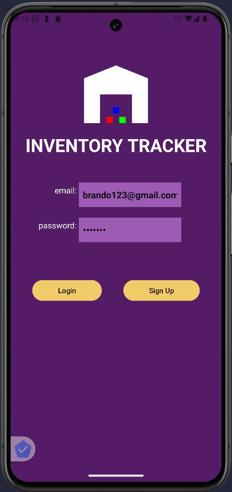
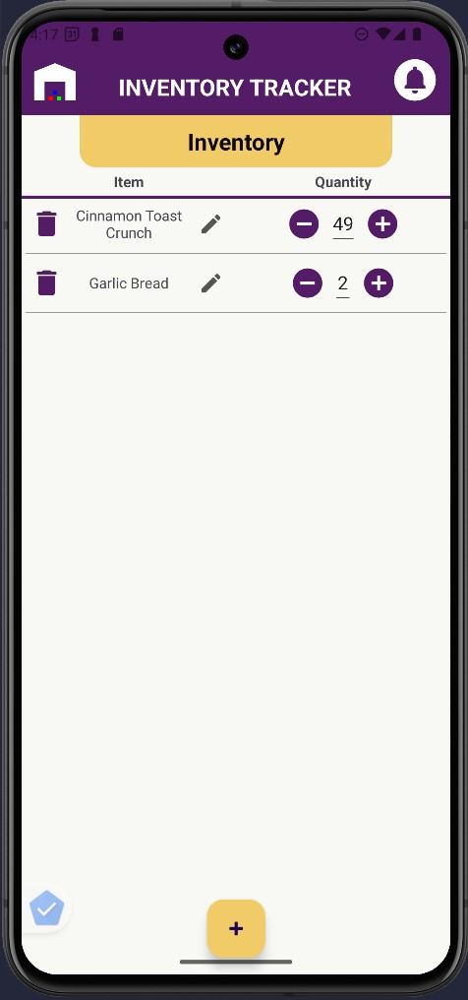
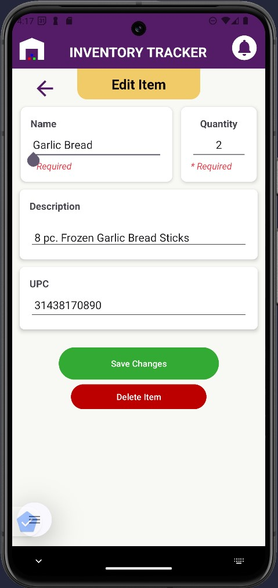

#### Page Contents

1. [Professional Self-Assessment](#professional-self-assessment)
2. [My Final Capstone Project](#my-final-capstone-project)
   - [Code Review](#code-review)
   - [Day Planner](#day-planner-java-junit-maven-javafx)
   - [Inventory Tracker](#inventory-tracker-android-studio-java-firebase-nosql)
3. [More of My Work](#more-of-my-work)
4. [Get in Touch](#get-in-touch)

---

## **Professional Self-Assessment**

My name is Michael Lorenz, and I am completing my Bachelor of Science in Computer Science this May. Throughout my coursework, I have focused on projects that highlight my strengths in software design, data structures and algorithms, and database management. My intention is to illustrate the culmination of my learning experiences with this portfolio to demonstrate my capabilities to potential employers.

**Shaping My Skills and Goals**  
As a developer, I am particularly intrigued by **backend and full-stack development**, an interest which has been shaped by the many core skills gained throughout development of these projects and assembling them into an ePortfolio:
- **Collaborating in a Team Environment**
  My courses frequently simulated team environments, utilizing collaborative strategies such as developing comprehensive software design documents for systems, effective communication with the professor, or in one instance practicing an Agile software development life cycle by simulating each Scrum team role (Scrum Master, Product Owner, Developer, Tester) to encourage continuous integration and delivery. This taught me the importance of clear communication and iterative improvement.

- **Communicating With Stakeholders**  
  In the same Scrum team simulation, I incorporated stakeholder communication by planning Sprint Reviews and integrating client feedback to update user stories. I've also frequently interacted with hypothetical clients for projects, such as by reading client-meeting transcripts, to refine my ability to understand the client's needs and translate them into software systems that address each requirement.

- **Data Structures and Algorithms**  
  I have implemented both standard (HashMaps) and more advanced (Radix Tries) data structures, deepening my understanding of trade-offs in speed, memory usage, and application complexity.

- **Software Engineering and Databases**  
  I've developed projects that integrate database, like MongoDB for a web-based database dashboard using the PyMongo driver, or Firebase Realtime Database for an Android CRUD application with a cloud-based NoSQL solution. I've also worked with SQLite for a local relational storage and querying solution.

- **Security Mindset**  
  I learned how to anticipate exploits and mitigate vulnerabilities, such as in a Spring Boot program where I addressed vulnerabilities found through static and functional testing, and integrated SHA-256 checksums to verify file integrity during data transfers. Proactively designing applications with security in mind and exhaustive testing is vital in preventing critical defects or attacks in the integrity of the software.  

**Overview of My Artifacts**  
For my final capstone course, I developed three enhancements to showcase core skills in Software Engineering/Design, Data Structures/Algorithms, and Databases. Each artifact—particularly my **Day Planner** application (enhanced to demonstrate GUI and data structure improvements) and my **Inventory Tracker** mobile application (enhanced with Firebase integration) serves as the basis of my professional journey and is representational of my dedication to building secure, user-friendly, and efficient applications.

---

## **My Final Capstone Project**

In my final Capstone course, I selected two of my original source-code artifacts to better reflect my software development expertise through additional enhancements. Below my code review, you’ll find a brief overview of each artifact, along with links to learn more about my enhancement process.

### Code Review

Prior to building my enhancements, I conducted a detailed code review of the original artifacts. In this **42-minute walkthrough**, I analyze the existing code, identify weaknesses, and plan enhancements to improve usability, efficiency, and security:

<iframe width="835" height="480" src="https://www.youtube.com/embed/MY6DrOzxTb0" title="Code Review - Michael Lorenz" frameborder="0" allow="accelerometer; autoplay; clipboard-write; encrypted-media; gyroscope; picture-in-picture; web-share" referrerpolicy="strict-origin-when-cross-origin" allowfullscreen></iframe>

*(42 Minutes, recorded Jan. 19, 2025)*

---

### **Day Planner** (Java, JUnit, Maven, JavaFX)
 

A **Java-based** system for managing contacts, tasks, and appointments--It began as a CRUD codebase with JUnit tests for managing <code>Appointment</code>, <code>Task</code>, and <code>Contact</code> objects. The original artifact lacked usability, so I used it as an opportunity to make two enhancements showcasing software engineering/design and data structures/algorithms skills.

**Enhancements:**

1. **JavaFX GUI** (Software Engineering/Design)  
   - Added a JavaFX interface for intuitive user interaction  
   - Implemented file-based data persistence (CSV)
   - Showcases my understanding of integrating user-facing elements with logic using object-oriented principles

2. **Radix Trie Sorting and Prefix Search Algorithm** (Data Structures and Algorithms)  
   - Implemented a Radix Trie to allow fast prefix-based searches  
   - Demonstrates my ability to optimize search operations and handle trade-offs in time vs. space complexity

<a href="/portfolio-site/dayplanner" class="btn-dark"> More About Day Planner</a>

---

### **Inventory Tracker** (Android Studio, Java, Firebase, NoSQL)

 

An **Android mobile application** for managing inventory items--The original artifact stored user credentials and inventory data locally using SQLite, and handled user authentication and SMS alerts for items reaching zero stock. To address security exploit concerns and improve practicality of the app, I transitioned from SQLite to a cloud-based NoSQL solution. 

**Enhancements:**
- **Firebase Integration** (Databases)  
  - Migrated from local SQLite to **Firebase Realtime Database**  
  - Incorporated secure user authentication, hashed credentials, and real-time sync  
  - Enhanced security by storing all credentials and data in a cloud-based NoSQL database

<a href="/portfolio-site/inventorytracker" class="btn-dark"> More About Inventory Tracker</a>

---

## **More of My Work**

Beyond my capstone enhancements, I’ve built and contributed to various other projects that further demonstrate my skills:

- **[AAC Database PyMongo Dashboard](https://github.com/Halfwitz/CS340-AAC-Database-Dashboard)** (Python, MongoDB, NoSQL, Dash)  
  
  Developed a data analytics dashboard that integrates with MongoDB. Users can filter, visualize, and map entries from the Austin Animal Center dataset. Employed PyMongo for database operations and Dash for real-time interactive charts and maps.
   
  

- **[AI Maze Solver using Deep Q-Learning](https://github.com/Halfwitz/CS370-Qlearning-Maze-Pathfinder)** (Python, TensorFlow, Keras) 
  
  Created a reinforcement learning agent that solves 2D mazes using a Deep Q-Learning algorithm. Implemented an epsilon-greedy policy, experience replay, and a multi-layer neural network to optimize pathfinding.
   
  

- **[OpenGL Interactive 3D Scene](https://github.com/Halfwitz/CS330-OpenGL-3D-Scene)** (C++, OpenGL, GLM, GLFW)
  
  Built a 3D application where users can navigate a virtual scene composed of 3D objects. Implemented transformations (scaling, rotation, translation), added realistic lighting (ambient, specular, diffuse), and enabled dynamic camera controls.
   
  

---

## **Get in Touch**

- **LinkedIn:** [linkedin.com/in/michael-lorenz-dev/]({{ site.navbar-links.linkedin-url }})  
- **GitHub:** [github.com/Halfwitz]({{ site.navbar-links.github-url }})  

You can also view my [Contact Page](/portfolio-site/contact) for more detailed information and additional ways to reach out. I look forward to connecting!

*- Michael Lorenz*