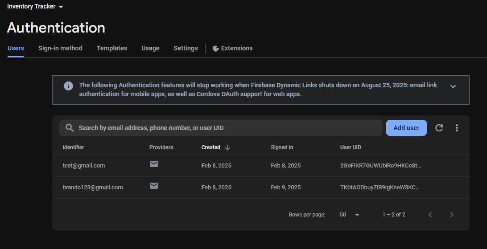

# Inventory Tracker

## Original Artifact Description
For **CS360 – Mobile Architect & Programming**, the goal was to develop an **inventory management mobile application** that meets real-world use cases for warehouse associates. The application:
- Allowed users to register and log in
 
- Stored and modified item details (name, description, quantity, and UPC)
 

- Sent SMS alerts when items reached zero stock
 

Originally, this artifact used a local **SQLite** database for user credentials and inventory data. While functional, storing passwords in plain text posed security risks, and local storage restricted multi-device usage. Despite these limitations, it aligned with **Database** concepts by illustrating how an internal SQL database integrates with an Android app.

## Enhancements
Below is the enhancement I made to the original artifact. This section can be expanded to read a **detailed narrative** of what was changed and why.

---

   
 <h3>Enhancement Narrative – Firebase Authentication & Realtime Database</h3> 

    
   
   

   <h4>Artifact Description</h4>

   
This Inventory Management Mobile Application, <i>Inventory Tracker</i>, began as a course project in <b>CS360 Mobile Architect & Programming</b>, where I was tasked with creating an Android app that stores and manages data in an SQLite database. The original artifact focused on warehouse management use cases, allowing employees to log in, manage product inventory (with name, description, quantity, and UPC attributes), and receive SMS notifications when items are out of stock. However, the original artifact contained a naively implemented local database for storing user credentials and inventory items, which posed security and usability issues (each user shared the same database that could only be logged into/viewed on one device). 

   
In my enhancement, I replaced the local SQLite implementation with Google Firebase Authentication and Realtime Database services to improve security by removing plain-text credentials from local storage and fixing an authentication bypass exploit. Specifically, the enhancement incorporates:
 

   <ul>
      <li><b>Firebase Realtime Database</b> - A secure cloud-based NoSQL storage solution that stores each user’s settings and uses rules to allow users to manage an inventory of items.</li>
      <li><b>Firebase Authentication</b> - Provides safe user authentication handling sign-in, sign-up, and secure sessions with automatic password hashing and issuing tokens.</li>
      <li><b>Improved project structure</b> - The original <code>InventoryDatabase</code> class was a monolith of responsibilities. It was split into <code>InventoryDatabase</code>/<code>UserDatabase</code> (data CRUD), <code>InputSanitizer</code> (secure input), and <code>AlertSender</code> (SMS logic) for modularity and readability. Similarly, <code>AuthManager</code> was split from <code>LoginActivity</code>.</li>
   </ul>

   <h4>Justification of Enhancements</h4>

   
I’ve chosen this artifact for my ePortfolio as an example of my capabilities in working with projects in alignment with the database category. <i>Inventory Tracker</i> has demonstrated my ability to transition from a local SQLite-based database to cloud-based NoSQL storage in Firebase. Additionally, enhancing this project allows me to address original limitations, flaws, and security vulnerabilities in the local database. For example, user credentials and inventory data could only be accessed on one device, and each user shared the same database. Also, storing passwords in plain text and enabling user-session persistence by saving the credentials to a preferences file enabled an exploit allowing a user to bypass authentication. External authentication and storage remedy these concerns and demonstrate secure user authentication skills by implementing Firebase email/password authentication with the <code>AuthManager</code> class to allow safe, authorized user access. Secure database management skills are shown by structuring a NoSQL database with rules for secure use with Firebase Realtime Database and communicating with it with the <code>UserDatabase</code> and <code>InventoryDatabase</code> API classes for CRUD operations. Finally, the enhancement showcases best practices in refactoring and organization by splitting overly complex classes into specialized classes to improve maintainability.
 

   <h4>Course Outcomes Achieved</h4>
   
   
 I’ve developed the enhancement to meet the course outcomes outlined in this capstone course.
 

   <ul>
      <li><b>Building Collaborative Environments</b> - Hosting the project on GitHub supports a collaborative workflow, and code documentation and inline comments encourage contributions or reviews.</li>
      <li><b>Designing and Evaluating Computing Solutions</b> - In planning the enhancement, I had to evaluate the trade-offs between the simpler local SQLite database, which was easier to implement but less secure, and a more secure cloud-based approach with Firebase. I addressed the security concerns by choosing Firebase and designing a structured NoSQL database.</li>
      <li><b>Utilizing Innovative Techniques and Tools</b> - Developing user authentication systems with secure credentials and token-based authorization or secure cloud-based databases from scratch is challenging, by adopting Firebase Realtime Database and Authentication, I demonstrate the ability to use modern cloud tools to implement these features efficiently. Refactoring to separate concerns into separate classes/methods also reflects industry-standard design techniques.</li>
      <li><b>Develop a Security Mindset</b> - I’ve identified and remedied vulnerabilities such as plain-text credentials, shared inventories, and insecure session handling using Firebase with rules-based access and password hashing to improve data privacy and address potential exploits. I’ve also implemented input validation for all input entering the database, preventing malformed data.</li>
   </ul>

   <h4>Enhancement Process Reflection</h4>

   
Transitioning this project from an SQLite implementation to a Firebase solution, I have greatly transformed the application's usability production-like implementation. Adding Firebase dependencies and configuring the app in the Firebase console was simple, as the platform automatically handles many security concerns. In development, implementing Firebase and integrating Firebase Authentication was straightforward, though in integrating the Realtime Database, I faced significant challenges teaching important lessons about asynchronous operations and architecture.

   
My original <code>InventoryDatabase</code> implementation used <em>synchronous</em> SQLite queries where methods like <code>getItem()</code> can return an item immediately, however, Firebase querying relies on <em>asynchronous</em> calls instead. I initially aimed to modify only the internal CRUD implementations of the <code>InventoryDatabase</code> class to allow the app to function the same without updating other classes, so I tried to keep the same synchronous return approach, but because the external classes calling <code>getItem()</code> or other methods expect a result instantly, this caused bugs in the code returning empty or null data before Firebase finished retrieving results. I realized I had to embrace Firebase’s asynchronous <code>.get()</code> and <code>.setValue()</code> calls by using callbacks to properly handle the data only after it arrives. This required rewriting many CRUD methods to accept callback interfaces, which meant that external classes for viewing and modifying the inventory (<code>NotificationsFragment</code>, <code>ItemFragment</code>, and <code>InventoryFragment</code>) had to be modified to pass callback implementations to the <code>InventoryDatabase</code> methods that handle callback results, ensuring the related UI components are updated only after a query or update is finished.

   
A concern I had with the real-time database was the security of users being able to interact with the database, so I also utilized the database rules in the Firebase console.

   <pre>
    {  "rules": {
      ".read": "auth != null", // authenticated users only can read/write
      ".write": "auth != null", 
      "users": {
        "$uid": {
          ".read": "$uid === auth.uid", // each user only read/writes their own data
          ".write": "$uid === auth.uid", 
          "inventory": {
            ".indexOn": ["name", "quantity"]
    }}}}}
   </pre>
   
Defining the rules like above ensures that only authenticated users can read/write to the database and that users can only access their own data that correlates with their unique identifier.

   
Thanks to these additions, this project demonstrates my software development skills in cloud database management, mobile app design, secure programming, and refactoring, which I will continue to improve and apply in future software development projects.

---

<a href="/portfolio-site" class="btn-dark"> Return to Portfolio Home </a>
<a href="https://github.com/Halfwitz/CS360-Inventory-Tracker-Android" class="btn-dark" target="_blank"> Original GitHub Repository </a>
<a href="https://github.com/Halfwitz/DayPlanner" class="btn-dark" target="_blank"> Enhanced GitHub Repository </a>